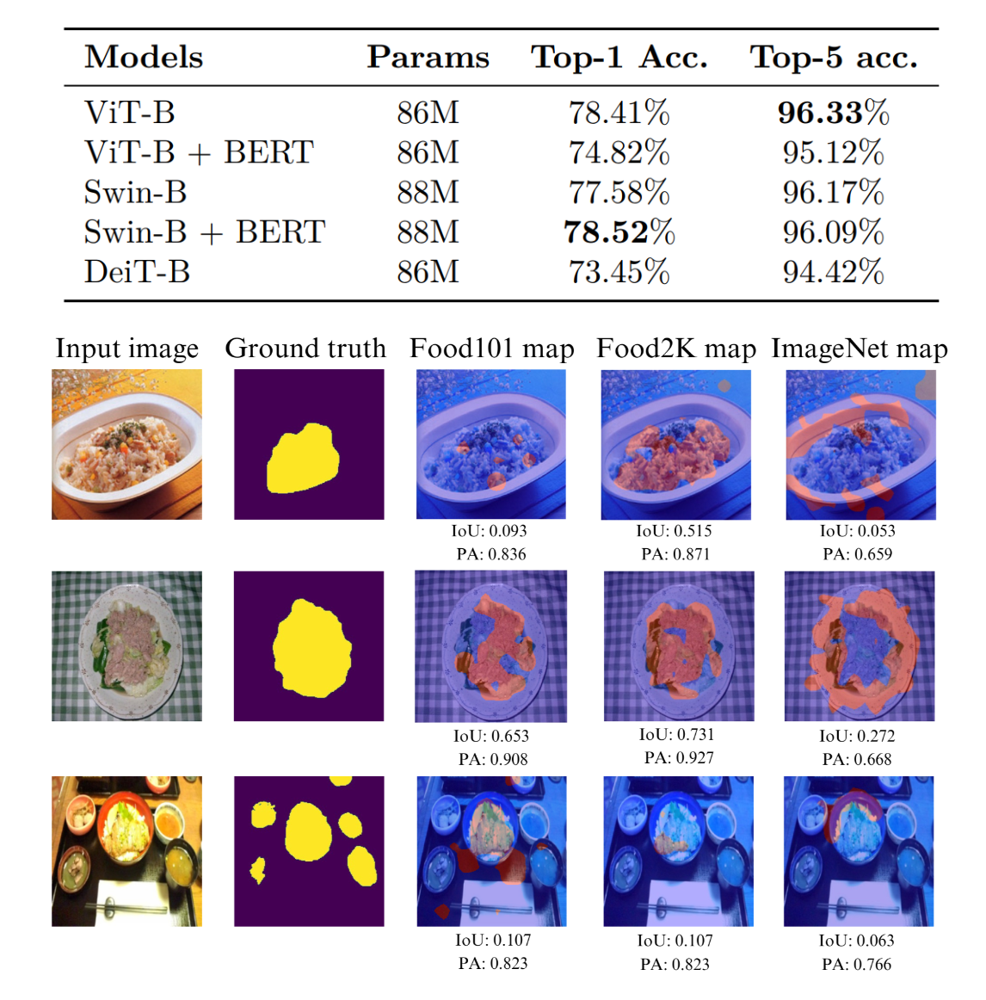
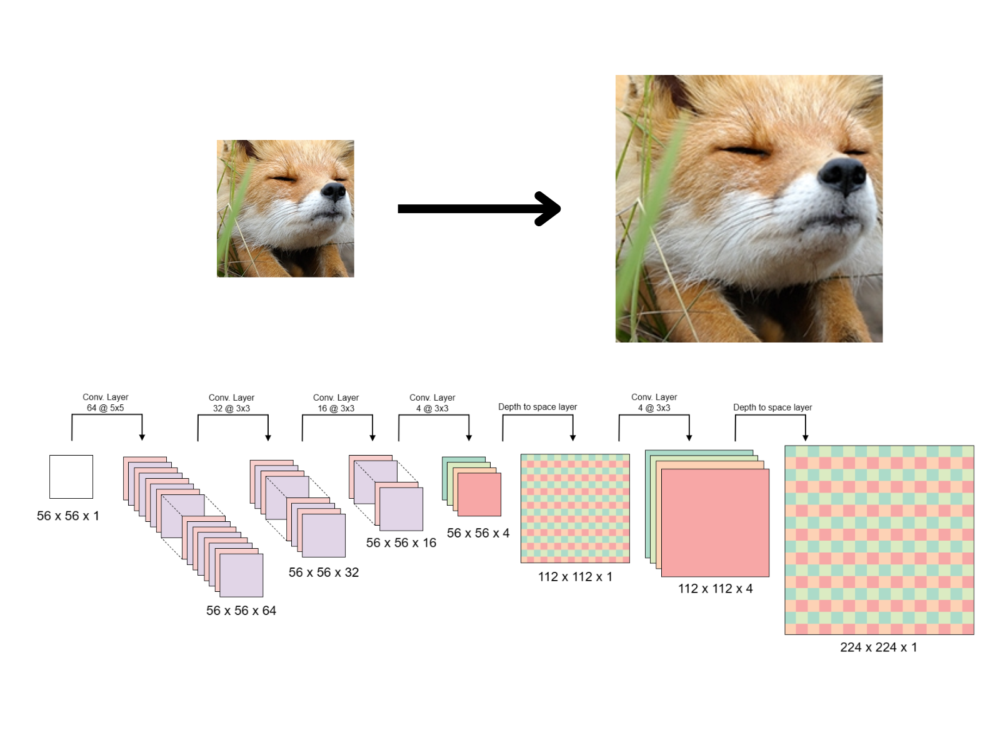
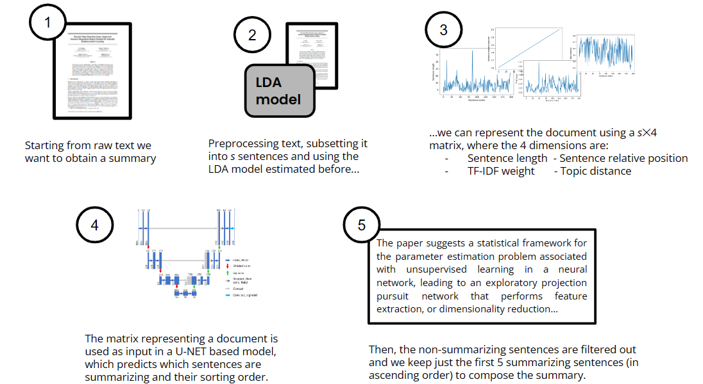
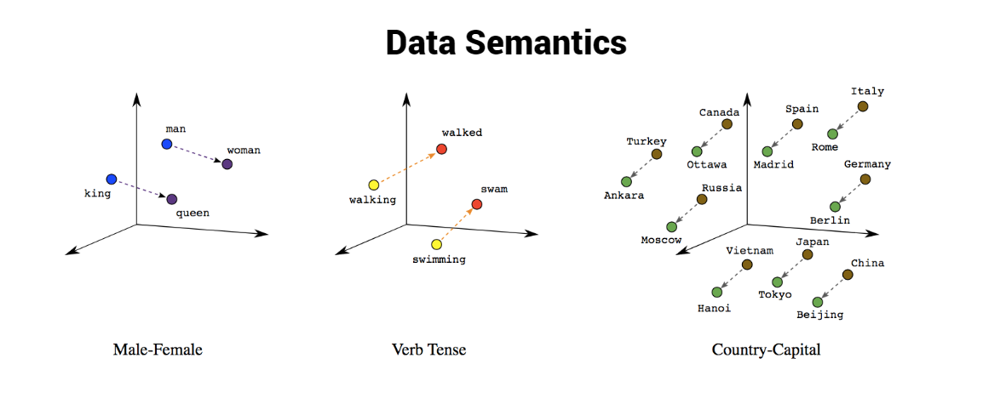
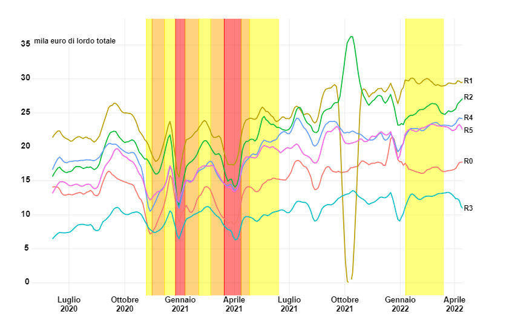
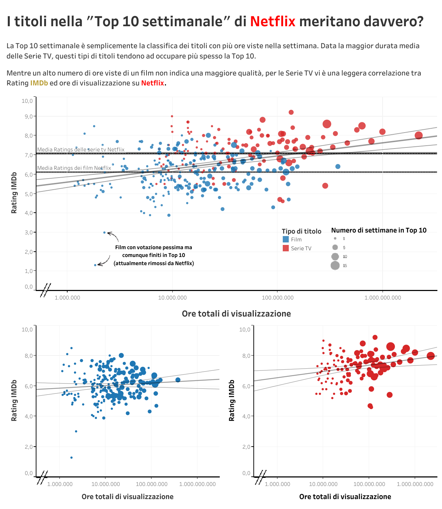
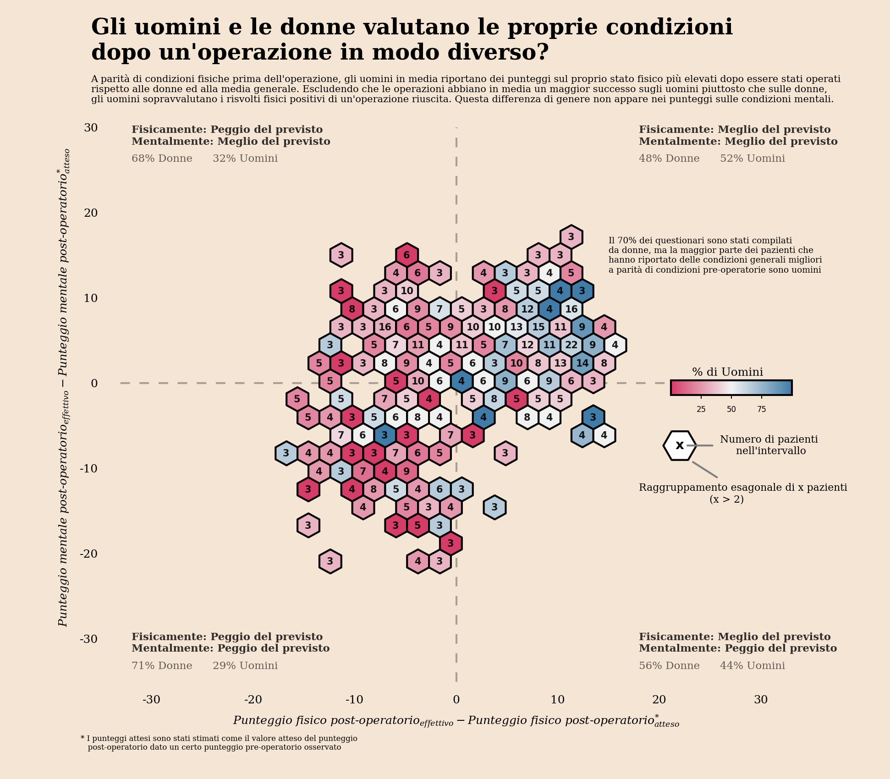
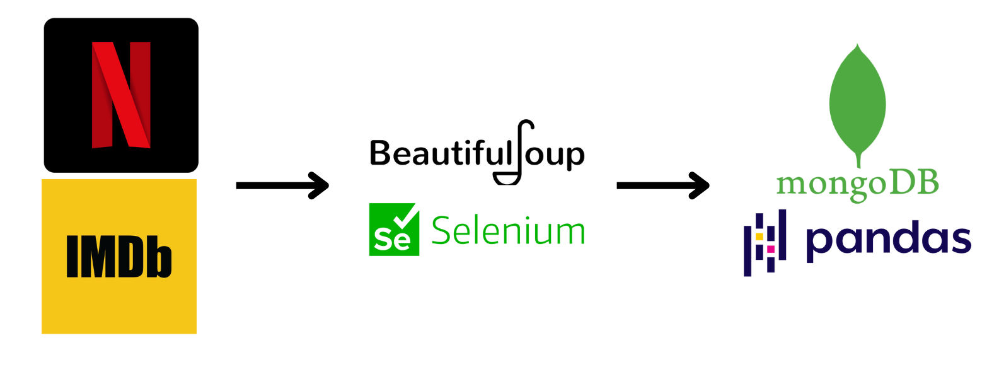

# Portfolio
---

## Computer Vision

### Master Thesis: Food Recognition with Image Transformers

<b>Image classification and segmentation</b> implemented using Vision transformers and Convolutional neural networks.
   
In this work, vision transformers, a category of models based on self-attention mechanisms, are used to address the task of food recognition. The work focuses on training and fine-tuning different vision transformer architectures on Food2K, a large-scale dataset of food images with 2,000 categories. The performance
of vision transformers are compared with convolutional neural networks (CNNs) on Food2K and
Food-101. The effects of pre-training on Food2K are studied, comparing the performances obtained
by using ImageNet weights and Food2K weights. Food-101 is used to assess the generalization capabilities of transformers, in order to test if these models are robust enough to be used in a real-world scenario. In addition, state-of-the-art explainability techniques are used to highlight the regions of interest that vision transformers take into account when performing a prediction. The relevancy maps obtained are compared to a ground-truth mask, to verify if transformers trained for recognition can achieve competitive results on a segmentation task.

 

 

### Image and Audio SuperResolution using CNN and GANs.

<b>CNN</b> and <b>GANs</b> for super resolution.
   
The main objective is to train Convolutional Neural Networks and Generative Adversarial Network for the task of super resolution: the enhancement of 1D (audio) and 2D(images) signals. This repository contains the demo that uses our trained models to apply super resolution to images and audio.

 

 

---
### Pill Quality Control / Classification and Augmentation.

<b>Image classification</b> and <b>augmentation</b> using traditional techniques and Generative Adversarial Neural Networks.
   
The first objective of this project is to perform classification on pills, specifically trying to detect if in a quality control scenario is possibile to detect pills with cosmetics defects like chips or dirt. This task has been carried out training CNNs from scratch and comparing them with pre-trained nets.
The second objective is to remedy for the lack of training data using generative adversarial neural networks (GANs), combined with traditional data augmentation.

 

 

---
## Natural Language Processing

### NIPS Papers: Topic Modelling and Text Summarization.

The Neural Information Processing System (NIPS) is a machine learning and computational neuroscience competition held every year from 1987 to date. We tackled a dataset containing all the papers submitted from 1987 to 2017, with the aim of applying unsupervised NLP models for topic modelling (LDA/PLSA) and a supervised approach for extractive text summarization (topic representation and indicator representation).
   

 

 

---
### 7 Deadly Sins Diachronical Analysis

The aim of the work is to perform a diachronic analysis of the 7 deadly sins to find out how their meaning and use has changed from the 19th century to the 21st century. Additionally, we tried implementing some comparison metrics for the embedding models we used.
 
This work involved using different word embedding techniques: Word2Vec and GloVe, while using CADE to align the text corpora and analyze the semantic difference of the words between the 1800s and 2000s. Additionally, we implemented a geometrical comparison technique to evaluate how different the embeddings are built between W2V and GloVe.

 

 

---

## Time Series Analysis

### Restaurant's Revenue Loss during first COVID-19 pandemic lockdown

<b> Time Series </b> Analysis and <b> Forecasting </b> (using <b> ARIMA </b>, and <b> Mixture models </b>) of a <b> restaurant's revenue </b> during the first lockdown of the COVID-19 pandemic in Italy, to estimate the loss incurred..
   
One of the sectors most affected by the Covid-19 pandemic has certainly been the restaurant industry. Due to the related restrictions, restaurant owners saw their revenues plummet dramatically. In such a historical period, it can be very useful to analyze historical data to try to study and predict what the daily or weekly revenues will be in order to adjust the supply of raw materials accordingly. In this paper, models from the ARIMA family and the Cluster-Weighted Model with and without cross-validation were used for forecasting time series.

 

 

---

## Data Visualization

### Netflix Top 10: Data Analysis & Interactive Visualization

Netflix calculates the "Weekly Top 10" simply by ordering movies or TV series based on the hours viewed in the last 7 days in descending order. But <b>does this ranking truly reward titles of higher quality or the most popular ones</b>? Are <b>movies and TV series treated equally</b>? <b>Is the Top 10 genuinely helpful</b> for users in selecting the best titles, or does it feature lower-quality content compared to what is available in Netflix's catalog?
 
Netflix is one of the most widely used streaming platforms, boasting over 214 million accounts. The platform employs one of the most effective recommendation systems, featuring on each user's homepage the most popular movies and TV series that align with the subscriber's preferences.

A common feature among all accounts is the "Weekly Top 10," which appears at the top of the homepage and is updated every Sunday. Millions of people see this list of the top ten movies or TV series every day, inevitably influencing users' choices. Furthermore, it serves as an invaluable showcase for every actor and director, both emerging and established.

The objective of this research is to analyze data related to each movie and TV series that made it into the Top 10 in the last six months to answer these research questions.

 

 

---
### Infographics: PROM score and the possible relationship with weather conditions

<b>PROMs are patient-reported outcome</b> measures following an operation or health treatment, often used to assess the quality of health care.
 
We evaluated, through some <b>infographics</b> made through Python, using the <b>matplotlib</b> and <b>Seaborn</b> libraries, the possible presence of a <b>relationship</b> between the <b>outcomes of mental and physical health status assessments</b> of a sample of patients, following surgery, and the <b>gender and time(day and night)</b> relative to the time of questionnaire completion.

 

 

---
## Data Management

### Data Acquisition and Modeling: Movies and Tv series using Netflix and IMDB Data

Data Acquisition and Modeling: <b>Document-based database</b> containing information related to <b>IMDB and Netflix</b>, <b>scraped</b> from various sources and obtained via API.
   
The following study focuses on the acquisition, aggregation, integration, cleaning, and storage of a series of datasets related to the Netflix streaming platform in MongoDB. In particular, various data acquisition techniques such as web scraping and APIs were employed. Once the necessary data to answer research questions were obtained, they underwent cleaning and enrichment. Dozens of attributes related to titles that made it into Netflix's weekly Top 10 were derived from data provided by IMDb. Through the comprehensive enrichment process, a more enriched dataset with a more "flexible" structure was obtained and stored in the document-based MongoDB database.

 

 

© 2023 Chiriaco Gaetano. Powered by Jekyll and the Minimal Theme.
